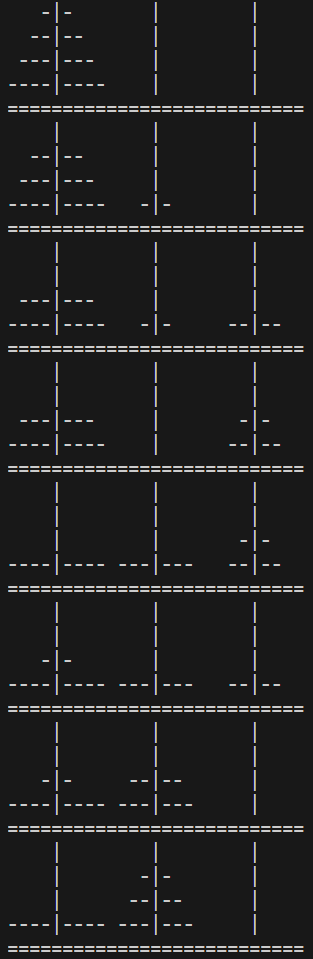

# Tower of Hanoi

## Rules of tower of hanoi
* All the discs present in tower 1 need to be transferrred to tower 3
* At each step we can transfer 1 disc
* A larger disc must never be placed on top of a smaller disc

## Description
* The code takes an input N which is the maximum number of discs to be transferred from tower 1 to 3
* It prints the setup of towers after each transfer of a disc

## Results

### Run-1 (3 discs)

  

### Run-2 (4 discs)

  
  

